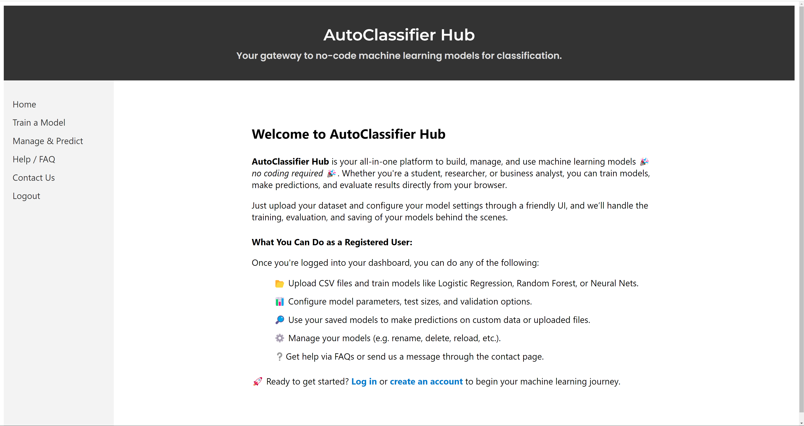
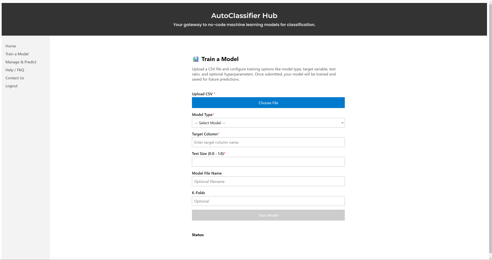
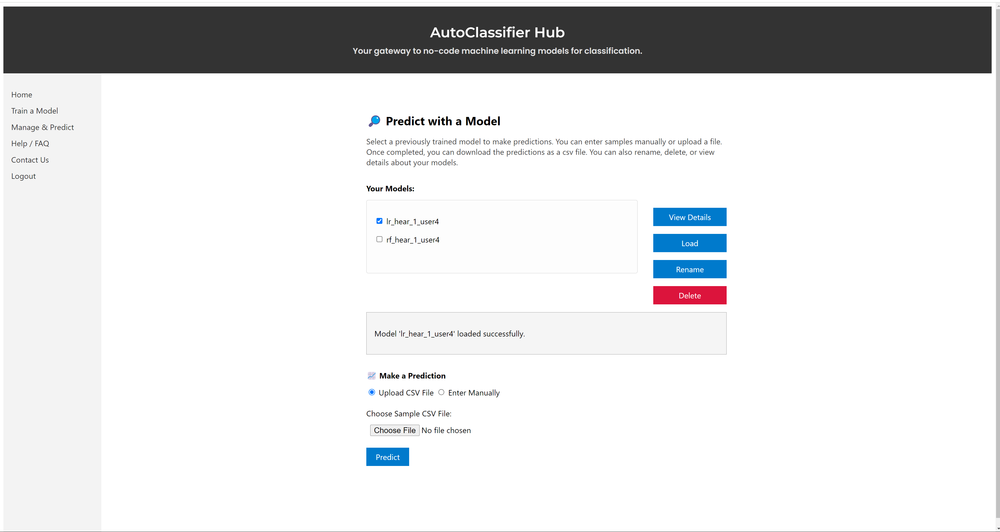

# AutoClassifier Hub

AutoClassifier Hub is a full-stack no-code machine learning platform for classification tasks.

📁 [Frontend (Vue)](client/)  
📁 [Backend (FastAPI)](server/)

👉 **This is a demo full-stack project** showcasing how to build a secure website for no-code training and deployment of ML models for classification. 

---

## 🧩 Project Overview

This project allows users to:
- Upload CSVs and train ML models without code
- Make predictions on new data
- Manage models and user accounts (admin only)

Built with:
- **Vue 3 + Vuex** (Frontend)
- **FastAPI + PostgreSQL** (Backend)
- **scikit-learn + Keras** for ML

---

---

## 🎯 Features

✔️ No-code model training via CSV uploads  
✔️ Predict with models via file or manual input  
✔️ Secure user authentication (JWT)  
✔️ Admin dashboard: list, delete users/models  
✔️ Responsive Vue UI with protected routes  
✔️ Model persistence with SQL + joblib/keras

---

## 🛠️ Tech Stack

**Frontend**: Vue 3, Vuex, Vue Router, Axios  
**Backend**: FastAPI, SQLAlchemy, PostgreSQL  
**ML**: scikit-learn, Keras  
**Auth**: JWT (JSON Web Token)  
**Others**: Vite, Pydantic, dotenv

---

## 📸 UI Preview

#### Home Page                     
 


#### Train a Model
 


#### Prediction 
 

---

## 🚀 Getting Started

#### 🖥 Backend

```bash
cd server
python -m venv venv
source venv/bin/activate  # or venv\Scripts\activate
pip install -r requirements.txt
uvicorn main:app --reload
````
---

#### 🌐 Frontend

```bash
cd client
npm install
npm run dev
```

---

## 📁 Folder Structure

```
auto-classifier-hub/
├── client/        # Frontend (Vue.js)
├── server/        # Backend (FastAPI)
├── data/          # Dataset sample
├── README.md      # You are here (root README)
```

---

## 📄 Documentation

* [Frontend Docs](client/README.md)
* [Backend Docs](server/README.md)

---

## 📌 Attribution / License

**AutoClassifier Hub** was developed as a demo full-stack project. You are welcome to reuse, modify, or adapt the code for educational or demo purposes. For any public or commercial usage, proper attribution is appreciated.

© 2025 Kamran Makarian
* **GitHub**: [KamranMakarian](https://github.com/KamranMakarian) 

---
