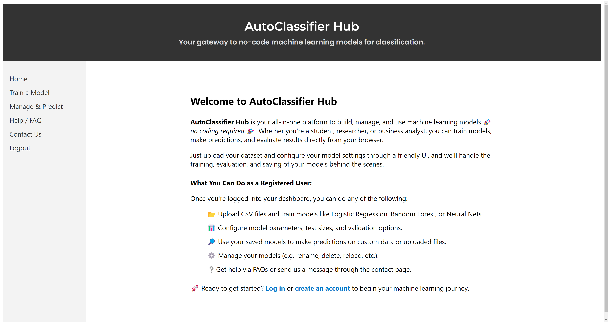

# AutoClassifier Hub: Frontend

---

### 📌 1. **Overview**

> This is the frontend of **AutoClassifier Hub**, a no-code classification platform built with Vue 3. It interacts with a FastAPI backend to allow users to train, manage, and use ML models through a clean web interface.

The frontend is optimized for usability and accessibility, providing:

* Intuitive navigation via sidebar
* Role-based interface (admin vs. user)
* Real-time feedback for training and prediction
* Clean display of model metadata, logs, and outputs

👉 **This is a demo full-stack project** showcasing how to build a secure website for no-code training and deployment of ML models for classification.  

<br>

#### UI Preview

| Home Page                     | Train a Model                   | Prediction                          |
| ----------------------------- | ------------------------------- | ----------------------------------- |
|  |  |  |


---

### 2. **Tech Stack**

| Layer            | Tech Used                  |
| ---------------- | -------------------------- |
| Framework        | Vue 3 (Composition API)    |
| State Management | Vuex                       |
| Router           | Vue Router                 |
| Styling          | CSS (custom)               |
| HTTP Client      | Axios                      |
| Auth             | JWT token (stored in Vuex) |

---

### ⚙️ 3. **Installation & Setup**

#### 1. Move to the frontend folder:

```bash
cd client
```

#### 2. Install dependencies:

```bash
npm install
```

#### 3. Start the Vite dev server:

```bash
npm run dev
```

Then go to: [http://localhost:5173](http://localhost:5173)

---

### 4. **Environment Variables**

Create a `.env` file inside the `client/` directory:

```env
VITE_REMOTE_API=http://127.0.0.1:8000
```

This tells the frontend where to send API requests. You can point this to your backend server (local or cloud).

---

### 5. **Available Routes**

| Route       | Description                  |
| ----------- | ---------------------------- |
| `/`         | Home page with overview      |
| `/login`    | User login                   |
| `/register` | User registration            |
| `/train`    | Train a model from a CSV     |
| `/predict`  | Load + use trained models    |
| `/admin`    | Admin dashboard (restricted) |
| `/help`     | FAQs and user help           |
| `/contact`  | Contact form and info        |

---


### 📁 6. **Project Structure**

```
client/
├── design/                        # Planning assets (requirements, wireframes)
│   ├── functional-requirements.md
│   └── wireframe.pdf
├── node_modules/                 # Installed npm packages (auto-generated)
├── public/                       # Static public assets (e.g. favicon)
│   ├── favicon.ico
│   ├── favicon-alien.ico
│   └── img/
├── screenshots/                  # UI screenshots for documentation
│   ├── home.png
│   ├── predict.png
│   └── train.png
├── src/                          # Main application source code
│   ├── assets/                   # Global CSS
│   │   ├── base.css
│   │   └── main.css
│   ├── components/               # Reusable Vue components
│   │   └── LoadingSpinner.vue
│   ├── router/                   # Route configuration
│   │   └── index.js
│   ├── services/                 # Axios service layer
│   │   └── AuthService.js
│   ├── store/                    # Vuex store for global state
│   │   └── index.js
│   ├── views/                    # Page-level views (routed components)
│   │   ├── AdminDashboard.vue
│   │   ├── ContactView.vue
│   │   ├── HelpView.vue
│   │   ├── HomeView.vue
│   │   ├── LoginView.vue
│   │   ├── LogoutView.vue
│   │   ├── PredictView.vue
│   │   ├── RegisterView.vue
│   │   └── TrainView.vue
│   ├── App.vue                   # Root Vue component
│   └── main.js                   # Entry point
├── .env                          # Environment config
├── .eslintrc.js                  # Linting config
├── .gitignore
├── index.html                    # HTML entry file for Vite
├── package.json                  # Project metadata and dependencies
├── package-lock.json             # Dependency lock file
├── vite.config.js                # Vite build config
└── README.md                     # Project documentation (you’re reading it!)

```

---

### 🎯 7. **Features**

* **Role-based navigation**
  Admins can access additional routes like `/admin`, while regular users see only the core interface.

* **Train + Predict views**
  Upload a CSV or send JSON input to train models or make predictions — with clean feedback and error handling.

* **JWT token management**
  Authentication tokens are stored in Vuex and passed to the backend via `Authorization` headers.

* **File Upload + JSON input**
  Flexible input options: use file-based datasets or manually enter sample data.

* **Admin-only capabilities**
  Admin users can list/delete users and manage all models across accounts.

---

### 8. **Troubleshooting**

* ❌ **CORS issues**
  If the frontend fails to fetch data from the backend, make sure the backend has CORS middleware enabled:

  ```python
  from fastapi.middleware.cors import CORSMiddleware
  ```

* ⚠️ **API requests fail / 404 Not Found**
  Double-check your `.env` in `client/` and ensure the backend URL is correct:

  ```env
  VITE_REMOTE_API=http://127.0.0.1:8000
  ```

* 🧪 **Blank screen or component not loading**
  Check for missing `.env`, frontend build errors in the console, or routing issues in `src/router/index.js`.

---

### 🚀 9. **Future Improvements**

These features could further enhance the app’s capabilities and appeal:

* **Confusion Matrix & Classification Report**
  Display performance metrics visually after training (accuracy, precision, recall, F1).

* **Model Evaluation Charts**
  Include ROC/AUC, learning curves, or feature importance graphs.

* **Chatbot Assistant**
  A sidebar or floating AI assistant to guide users through uploading, selecting parameters, and interpreting results.

* **Multi-file Upload & Dataset Manager**
  Let users manage multiple datasets and models in a more organized dashboard.

* **Token expiration + Refresh Logic**
  Add automatic token refresh support for long-lived sessions.

* **Testing + Validation**
  Integrate unit and E2E tests using something like [Cypress](https://www.cypress.io/) or [Vitest](https://vitest.dev/).

---

### 📌 10. **Attribution / License**

This frontend was developed as part of the **AutoClassifier Hub** full-stack project. You are welcome to reuse, modify, or adapt the code for educational or demo purposes. For any public or commercial usage, proper attribution is appreciated.

© 2025 Kamran Makarian
* **GitHub**: [KamranMakarian](https://github.com/KamranMakarian) 

---


